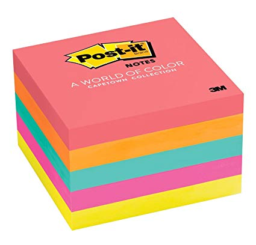
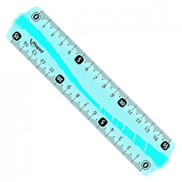

# ShmupCV

ShmupCV est un subtil mélange entre l'abréviation désignant le genre "Shoot'Em Up" et la bibliothèque graphique "OpenCV".

Le projet est -fortement- inspiré par le classe et classique "Ikaruga", Shmup dans lequel il faut alterner entre deux couleurs pour tuer ses ennemis et mener à bien les -infâmes- niveaux. Enorme innovation -qui mériterait après réflexion une commercialisation à 30€-, en plus de pouvoir jouer au clavier, il est possible de jouer avec un dispositif extraordinaire, teasing.

Moins cher qu'une Kinect (R.I.P.) et plus cool qu'une nostalgique Eyetoy, jouer avec :

Une webcam + des post-it + une règle.

  
  
  

Un dispositif disponible ici : 

https://www.latlmes.com/tech/shmupcv-stuff-for-only-127-dollars-1

## Mais comment ça se joue ? 
Votre vaisseau peut alterner entre deux couleurs, dans notre exemple le jaune et le bleu. Les ennemis sont soit de la première soit de la seconde couleur.

Lorsque votre vaisseau est en jaune, vous êtes inoffensif aux tirs des ennemis de la même couleur mais vous ne leur faîtes pas de dégats pour autant. Cependant, vous pourrez détruire les vaisseaux de la couleur opposée, ici le bleu.

Bref, pour tuer les saligauds jaunes, il faut tirer des bouboules bleues. 
Pour tirer des bouboules jaunes, il faut tuer des saligauds bleus.
Euh.. non attendez, c'est ça ou pas ? Laissez tomber. 

  

## Daltonien ?
Notre jeu aussi flexible qu'une personne âgée experte en yoga, vous permet de choisir les couleurs que vous souhaitez afficher pour les différentes entités. 

## Vidéo de présentation du jeu :

https://youtu.be/QfLZ563lHq0

Have fun.

## Team

**Valentin Moulard**  
**Axel Tétart**  
**Takie Yamani**  
